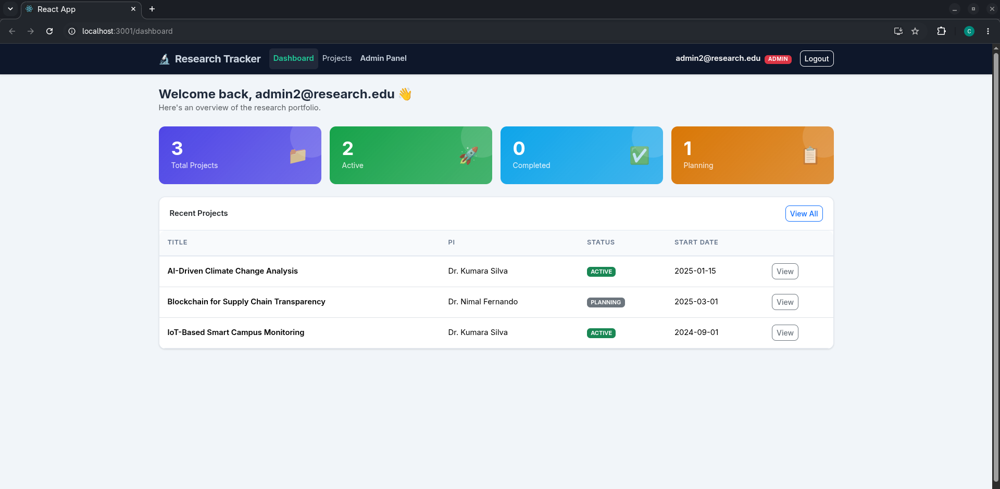
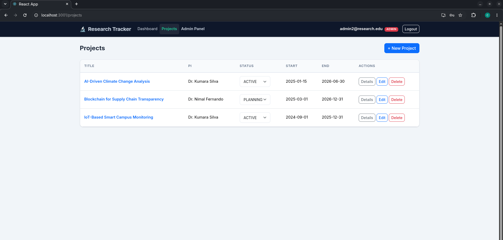
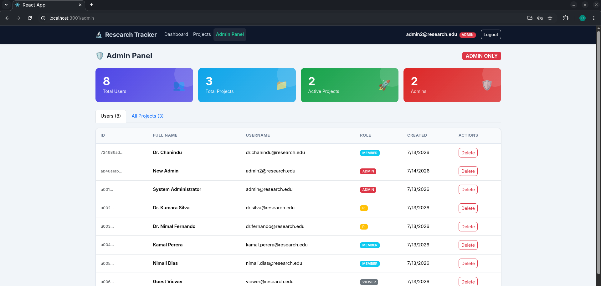

# 🔬 Research Project Tracker — Frontend

A responsive, role-based React + TypeScript single-page application for managing research projects, milestones, and documents. Built as the frontend for the CMJD Final Project.

---

## 📋 Assignment Context

**Assignment 2: Front-End Development with React**  
Educational Institute: IJSE (Institute of Software Engineering)  
Backend: Spring Boot REST API with JWT authentication

---

## 🛠️ Tech Stack

| Technology | Purpose |
|---|---|
| React 18 (CRA TypeScript) | UI framework |
| TypeScript | Static typing |
| React Router DOM v6 | SPA navigation |
| Axios | HTTP client + interceptors |
| React Bootstrap 5 | Responsive UI components |
| Context API | Global auth state |
| jwt-decode | Decode JWT tokens client-side |

---

## 🚀 Setup Instructions

### Prerequisites
- Node.js ≥ 18
- Spring Boot backend running on `http://localhost:8081`

### Installation

```bash
# 1. Clone the repository
git clone <repository-url>
cd Research-Tracker-Frontend

# 2. Install dependencies
npm install

# 3. Start development server
npm start
```

The app runs at `http://localhost:3000`.

### Backend must be running first
Ensure your Spring Boot backend is started:
```bash
cd ../Research-Tracker-Backend
./mvnw spring-boot:run
```

### Test Credentials (Default)
To log in and test the application, use the following credentials.

| Role | Username | Password |
|---|---|---|
| **ADMIN** | `admin2@research.edu` | `password123` |
| **PI** | `dr.silva@research.edu` | `password123` |
| **MEMBER** | `kamal.perera@research.edu` | `password123` |
| **VIEWER** | `viewer@research.edu` | `password123` |

---

## 📁 Project Structure

```
src/
├── assets/               # Static assets (images, icons)
├── components/
│   ├── common/           # Reusable: Spinner, AlertMessage, StatusBadge
│   └── layout/           # AppNavbar
├── context/
│   └── AuthContext.tsx   # JWT auth state + hooks
├── hooks/                # Custom hooks (future use)
├── interfaces/
│   └── index.ts          # All TypeScript interfaces mirroring backend DTOs
├── layouts/
│   └── MainLayout.tsx    # Shell with navbar + outlet
├── pages/
│   ├── auth/             # LoginPage, RegisterPage
│   ├── dashboard/        # DashboardPage
│   ├── projects/         # ProjectsPage, ProjectDetailPage
│   ├── milestones/       # MilestonesPage
│   ├── documents/        # DocumentsPage
│   └── admin/            # AdminPage (ADMIN role only)
├── routes/
│   └── ProtectedRoute.tsx # ProtectedRoute, RoleRoute, GuestRoute
├── services/             # Axios API service layer
│   ├── axiosInstance.ts  # Base config + interceptors
│   ├── authService.ts
│   ├── projectService.ts
│   ├── milestoneService.ts
│   ├── documentService.ts
│   └── userService.ts
├── styles/
│   └── global.css        # Global design system
└── utils/                # Utility helpers (future use)
```

---

## 🔒 Authentication Flow

1. User submits credentials → `POST /api/auth/login`
2. Backend returns `{ token, userId, username, role }`
3. Token stored in `localStorage`
4. Every Axios request automatically attaches `Authorization: Bearer <token>`
5. On 401 response → token cleared, user redirected to `/login`
6. JWT expiry checked client-side on every page load

---

## 🧭 Routes

| Path | Component | Access |
|---|---|---|
| `/login` | LoginPage | Public (guest only) |
| `/register` | RegisterPage | Public (guest only) |
| `/dashboard` | DashboardPage | All authenticated users |
| `/projects` | ProjectsPage | All authenticated users |
| `/projects/:id` | ProjectDetailPage | All authenticated users |
| `/projects/:id/milestones` | MilestonesPage | All authenticated users |
| `/projects/:id/documents` | DocumentsPage | All authenticated users |
| `/admin` | AdminPage | ADMIN role only |

---

## 👤 Role-Based Access

| Feature | ADMIN | PI | MEMBER | VIEWER |
|---|:---:|:---:|:---:|:---:|
| View projects | ✅ | ✅ | ✅ | ✅ |
| Create project | ✅ | ✅ | ❌ | ❌ |
| Edit project | ✅ | ✅ | ❌ | ❌ |
| Delete project | ✅ | ❌ | ❌ | ❌ |
| Add milestone | ✅ | ✅ | ✅ | ❌ |
| Edit milestone | ✅ | ✅ | ✅ | ❌ |
| Delete milestone | ✅ | ✅ | ❌ | ❌ |
| Upload document | ✅ | ✅ | ✅ | ❌ |
| Delete document | ✅ | ✅ | ❌ | ❌ |
| Admin panel | ✅ | ❌ | ❌ | ❌ |

---

## 📡 Backend API Endpoint Summary

### Authentication
| Method | Endpoint | Description |
|---|---|---|
| POST | `/api/auth/signup` | Register new user (returns JWT) |
| POST | `/api/auth/login` | Login (returns JWT) |

### Projects
| Method | Endpoint | Description |
|---|---|---|
| GET | `/api/projects` | List all projects |
| GET | `/api/projects/:id` | Get project by ID |
| POST | `/api/projects` | Create project (ADMIN, PI) |
| PUT | `/api/projects/:id` | Update project (ADMIN, PI) |
| PATCH | `/api/projects/:id/status` | Update status (ADMIN, PI) |
| DELETE | `/api/projects/:id` | Delete project (ADMIN) |

### Milestones
| Method | Endpoint | Description |
|---|---|---|
| GET | `/api/projects/:id/milestones` | List milestones for project |
| POST | `/api/projects/:id/milestones` | Add milestone (ADMIN, PI, MEMBER) |
| PUT | `/api/milestones/:id` | Update milestone (ADMIN, PI, MEMBER) |
| DELETE | `/api/milestones/:id` | Delete milestone (ADMIN, PI) |

### Documents
| Method | Endpoint | Description |
|---|---|---|
| GET | `/api/projects/:id/documents` | List documents for project |
| POST | `/api/projects/:id/documents` | Upload document (ADMIN, PI, MEMBER) |
| DELETE | `/api/documents/:id` | Delete document (ADMIN, PI) |

### Users (Admin Only)
| Method | Endpoint | Description |
|---|---|---|
| GET | `/api/users` | List all users (ADMIN) |
| GET | `/api/users/:id` | Get user by ID |
| DELETE | `/api/users/:id` | Delete user (ADMIN) |

---

## 🌿 Git Branching Strategy

```
main         ← stable production-ready code
development  ← integration branch
feat/*       ← individual feature branches
fix/*        ← bug fix branches
```
---

## 📸 Screenshots

> 


---

## 👨‍💻 Author

**Chanindu Imanjith**  
CMJD Final Project — Institute of Software Engineering (IJSE)
